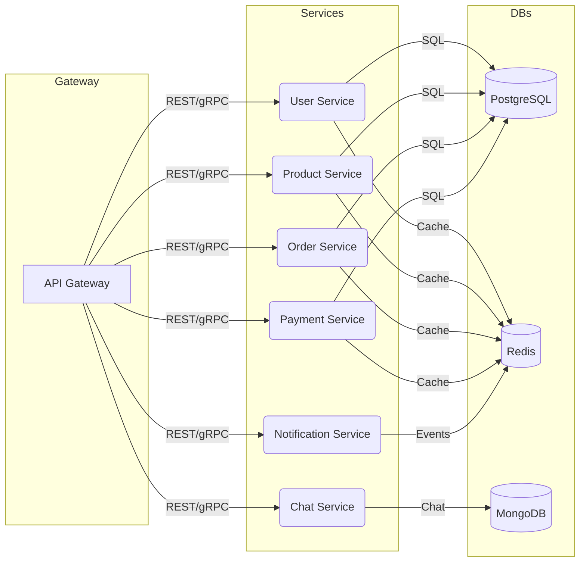

<div align="center">

# 🎮 LootBay — Современный игровой маркетплейс

[](https://github.com/reazonvan/LootBay/actions)
[](LICENSE)
[](https://github.com/reazonvan/LootBay/issues)
[](https://github.com/reazonvan/LootBay/network/members)
[](https://github.com/reazonvan/LootBay/stargazers)
[](https://github.com/reazonvan/LootBay/graphs/contributors)

</div>

> Микросервисная платформа для торговли игровыми активами, вдохновлённая FunPay. Современный стек, продвинутая архитектура, готовность к продакшену.

---

## 🔗 Quick Links
- [🚀 Быстрый старт](#-быстрый-старт)
- [🏗️ Архитектура](#-архитектура)
- [📦 Микросервисы](#-микросервисы)
- [🛠️ Разработка](#️-разработка)
- [📊 API Документация](#-api-документация)
- [🔐 Безопасность](#-безопасность)
- [📈 Мониторинг](#-мониторинг)
- [🗺️ Roadmap](#️-roadmap)
- [🤝 Вклад](#-вклад-в-проект)
- [📄 Лицензия](#-лицензия)

---

## 🏗️ Архитектура



---

## 📦 Микросервисы

- **User Service** — регистрация, аутентификация, профили, роли
- **Product Service** — товары, категории, поиск
- **Order Service** — escrow, статусы, споры
- **Payment Service** — Stripe/PayPal, баланс, возвраты
- **Chat Service** — WebSocket чат, история, автоответчики
- **Notification Service** — email, Telegram, push

<details>
<summary>Возможности (чек-лист)</summary>

- [x] Микросервисная архитектура
- [x] JWT аутентификация (Access + Refresh)
- [x] Ролевая система (OWNER, ADMIN, MODERATOR, SUPPORT)
- [x] Современный UI (Next.js + Tailwind)
- [x] Docker контейнеризация
- [x] CI/CD (GitHub Actions)
- [x] Мониторинг (Prometheus, Grafana)
- [x] Rate limiting, Circuit Breaker
- [x] Безопасность (bcrypt, CORS, security headers)
- [x] Документация и примеры API
- [ ] Kubernetes (в разработке)
- [ ] Production-ready деплой (в разработке)

</details>

---

## 🚀 Быстрый старт

```bash
# 1. Клонируйте репозиторий
 git clone https://github.com/reazonvan/LootBay.git
 cd LootBay

# 2. Настройте переменные окружения
 cp .env.example .env

# 3. Установите зависимости и запустите инфраструктуру
 make deps
 make up

# 4. Примените миграции
 make migrate-up

# 5. Запустите API Gateway и фронтенд
 make monitor-gateway
 cd web && npm install && npm run dev
```

- Frontend: http://localhost:3000
- API Gateway: http://localhost:8080
- Grafana: http://localhost:3000 (admin/admin)
- Prometheus: http://localhost:9090

---

## 🛠️ Разработка

```bash
# Тесты
make test              # Все тесты
make test-unit         # Unit тесты
make test-integration  # Интеграционные тесты
make test-coverage     # Покрытие кода

# Миграции
make migrate-up        # Применить миграции
make migrate-down      # Откатить миграции

# Мониторинг
make monitor-health    # Проверить здоровье
make monitor-metrics   # Метрики Prometheus

# Разработка
make build            # Собрать все сервисы
make lint             # Проверить код
make fmt              # Форматирование кода
```

<details>
<summary>Структура проекта</summary>

```
lootbay/
├── cmd/           # Точки входа для сервисов
├── internal/      # Внутренние пакеты
├── pkg/           # Переиспользуемые пакеты
├── docker/        # Docker файлы
├── k8s/           # Kubernetes манифесты
├── migrations/    # Миграции БД
├── tests/         # Тесты
└── web/           # Frontend (Next.js)
```
</details>

---

## 📊 API Документация

- Swagger: http://localhost:8080/swagger (в разработке)
- [ROLES_SYSTEM.md](ROLES_SYSTEM.md) — описание ролевой системы

**Примеры запросов:**

```bash
# Регистрация
curl -X POST http://localhost:8080/api/v1/auth/register \
  -H "Content-Type: application/json" \
  -d '{"email": "user@example.com", "username": "testuser", "password": "SecurePass123!"}'

# Вход
curl -X POST http://localhost:8080/api/v1/auth/login \
  -H "Content-Type: application/json" \
  -d '{"login": "user@example.com", "password": "SecurePass123!"}'
```

---

## 🔐 Безопасность

- JWT токены (Access + Refresh)
- Bcrypt для паролей
- Rate limiting, Circuit Breaker
- CORS, security headers
- Input validation, sanitization
- Environment variables для секретов
- Structured logging

Подробнее: [SECURITY.md](SECURITY.md)

---

## 📈 Мониторинг

- Prometheus: http://localhost:9090
- Grafana: http://localhost:3000
- Health Checks, Business Metrics

---

## 🗺️ Roadmap

- [x] User Service, Auth, Roles
- [x] Product/Order/Payment/Chat/Notification Services (MVP)
- [x] CI/CD, Docker, Monitoring
- [ ] Kubernetes, Production-ready деплой
- [ ] UI/UX улучшения, мобильная версия
- [ ] Интеграция с внешними API

---

## 🤝 Вклад в проект

Мы приветствуем вклад! Ознакомьтесь с [CONTRIBUTING.md](CONTRIBUTING.md) и создайте Pull Request.

---

## 📄 Лицензия

MIT — см. [LICENSE](LICENSE) 
